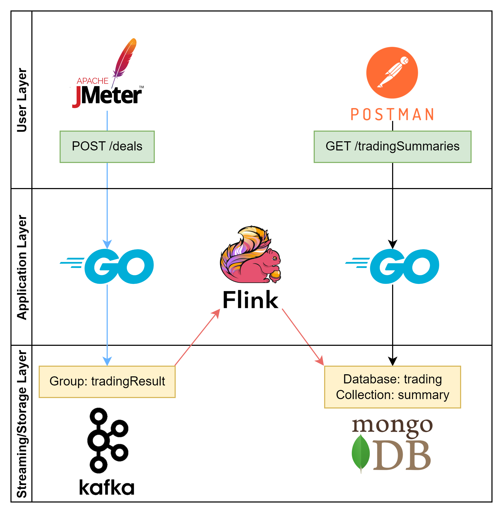

# DataDrivenDemo
This is a data streaming demo project implemented in Golang, Flink, Kafka, MongoDB, and JMeter.

---

## Architecture


## Data Definition
1. go-api: A restful-API application which records all trading deal result.
   1. The following data structure defines the dealing status of every forex transaction.
   2. For example, a AUDCAD trade which deals at price 0.9 and volume 50 units would be recorded as: `{BaseCurrency: AUD, QuotedCurrency: USD, Price: 0.9, Volume: 50}`.
```go
type Deal struct {
	BaseCurrency   string  `json:"base_currency"`
	QuotedCurrency string  `json:"quoted_currency"`
	Price          float64 `json:"price"`
	Volume         float64 `json:"volume"`
}
```
2. flink: A data streaming application which profiling dealing summary such as the current turnover and volume of each BaseCurrency in real time.
   1. The following data structure defines the total trading summary for each BaseCurrency.
```java
public class SummaryAccumulator {
    public String key;
    public double turnover;
    public double volume;
    public double count;
    public ConcurrentHashMap<String, HashMap<String, Double>> currencyMap = new ConcurrentHashMap<>();
}
```

## Start all applications
1. Install and start Zookeeper and Kafka server on port 2181 and 9092 respectively.
2. Install and start MongoDB on port 27017.
3. Start restful API application in project "go-api" on port 8081.
4. Start Flink data-streaming application in project "flink".
5. Run JMeter auto-testing script under the dictionary "jmeter-scripts".

## Containerization
1. Alternatively, you can also execute `docker-compose up` based on docker-compose.yml under the root path of this project to launch all applications mentioned above.
2. There are two dockerfiles under the following two projects, "flink" and "go-api". These files are used to package them.
3. Hence, you can execute `docker build -t <imageName> .` and `docker run <imageName>` under the root path of project "flink" and "go-api", to launch these two applications individually, and remain your mongoDB and Kafka server launched on your host network, rather than container.
   1. Steps to individually launch the project "flink" with docker.
   ```
   docker build -t flink .
   docker run flink
   ```
   2. Steps to individually launch the project "go-api" with docker.
   ```
   docker build -t go-api .
   docker run --rm -p 8081:8081 --add-host host.docker.internal:host-gateway -it go-api
   ```

## Future improvement
1. Fully and more realistic Forex data integration.

## Appendix
### How to start kafka standalone on windows OS without using containerized kafka.
1. Initialization
   1. [Download Kafka]{https://www.geeksforgeeks.org/how-to-install-and-run-apache-kafka-on-windows/}
   2. Start Zookeeper
   ```sh
   .\bin\windows\zookeeper-server-start.bat .\config\zookeeper.properties
   ```
   3. Start Kafka
   ```sh
   .\bin\windows\kafka-server-start.bat .\config\server.properties
   ```
2. Cunsumer & Producer
   1. Start Consumer
   ```
   .\bin\windows\kafka-console-consumer.bat --bootstrap-server localhost:9092 --topic rawData --from-beginning
   ```
   4. Start Producer
   ```
   .\bin\windows\kafka-console-consumer.bat --bootstrap-server localhost:9092 --topic cookedData --from-beginning
   ```
3. Topic Manipulation
   1. Create topic
   ```
   .\bin\windows\kafka-topics.bat --create --bootstrap-server localhost:9092 --replication-factor 1 --partitions 1 --topic tradingResult
   ```
   2. Search topic
   ```
   .\bin\windows\kafka-topics.bat --list --bootstrap-server localhost:9092
   ```
   3. Delete topic
   ```
   .\bin\windows\kafka-topics.bat --bootstrap-server localhost:9092 --delete --topic tradingResult
   ```
